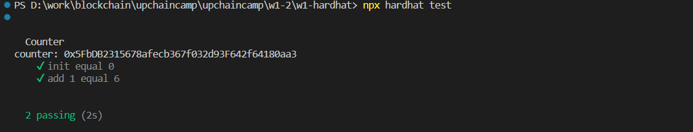
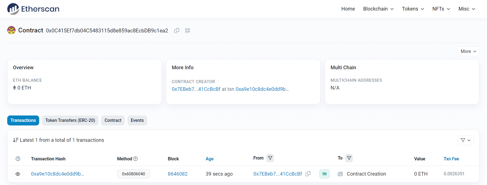
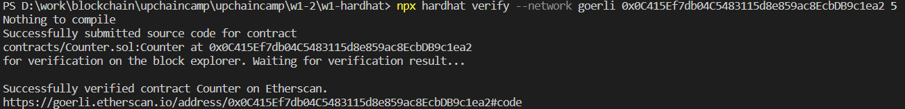
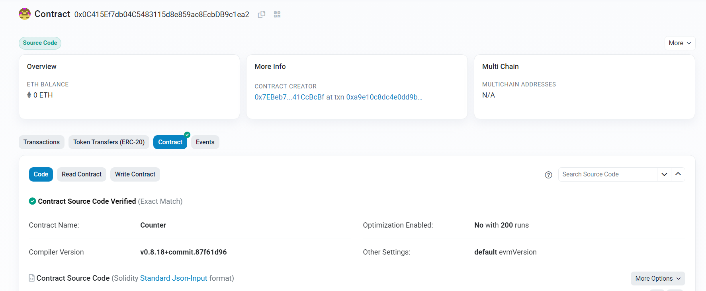
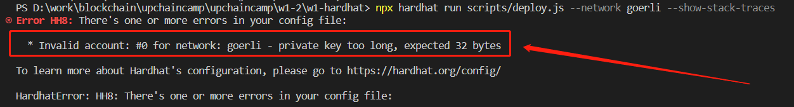
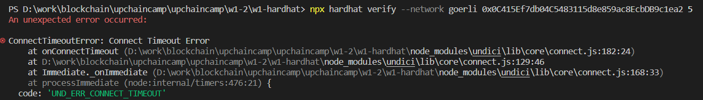
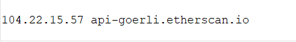
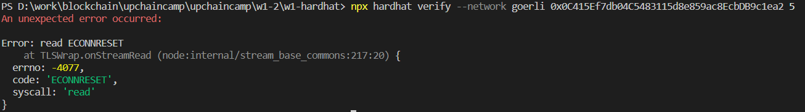
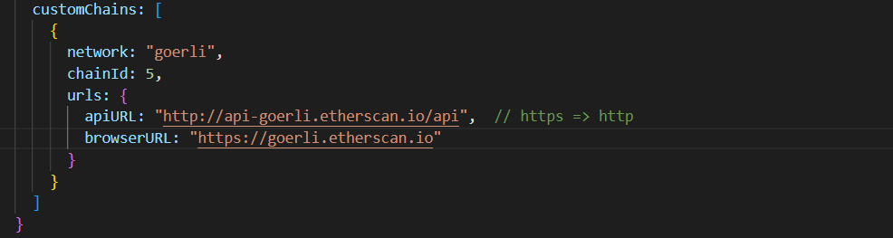

## 1 合约
略
## 2 测试

## 3 部署
合约地址：0x0C415Ef7db04C5483115d8e859ac8EcbDB9c1ea2

## 4 验证

## 5 错误记录
1. 错误一：

原因：.env文件结尾不需要添加分号
2. 错误二：出现connect timeout  

解决：  
  
接着又出现新的错误：    
  
解决：https改为http   
  
详情参考了：  
https://github.com/NomicFoundation/hardhat/issues/2348  
https://github.com/smartcontractkit/full-blockchain-solidity-course-js/discussions/2247#discussioncomment-3590929